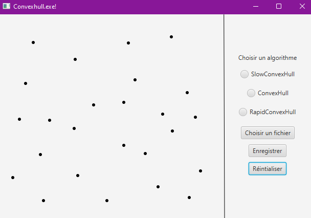

# L2_ProjetSynthese-S4
Projet de synthèse fait durant le S4 de la L2 Info.  
Projet fait par :
- [Brice ORLIANGE](mailto:briceorl54580@gmail.com), du groupe TP4
- [Matthieu FRITSCH](mailto:mattfritsch98380@gmail.com), du groupe TP4

________________________________________________________________________________________________________________________
# INTERFACE GRAPHIQUE
________________________________________________________________________________________________________________________

# Consigne d'exécution
Voici les consignes d'exécution de ce projet.  
Nous n'avons pas trouver comment compiler et exécuter l'interface en ligne de commande.
Nous lancons notre interface graphique grace à notre IDE

# Rendu de l'interface graphique

# Fonctionnalité réalisé
- Ouverture d'un fichier pour afficher les points qui sont contenu dans le fichier à l'aide du bouton "Choisir un fichier".
- Créer des points depuis l'interface puis les ajouter dans un fichier créé depuis l'interface à l'aide du bouton "Enregistrer".
- Réintialiser les points et supprimer les points présent sur l'interface à l'aide du bouton "Réintialiser".
